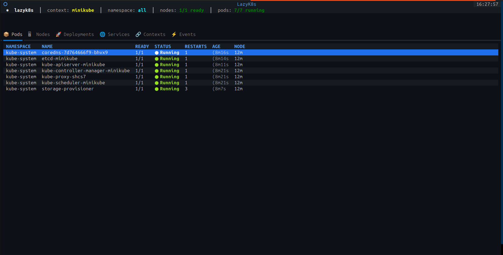
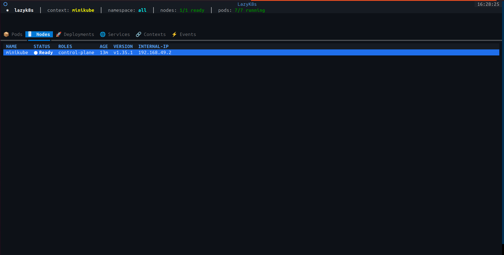
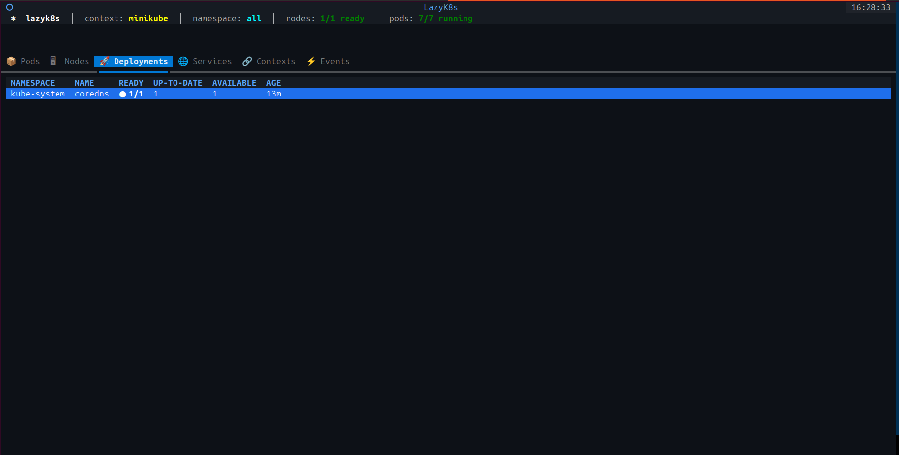
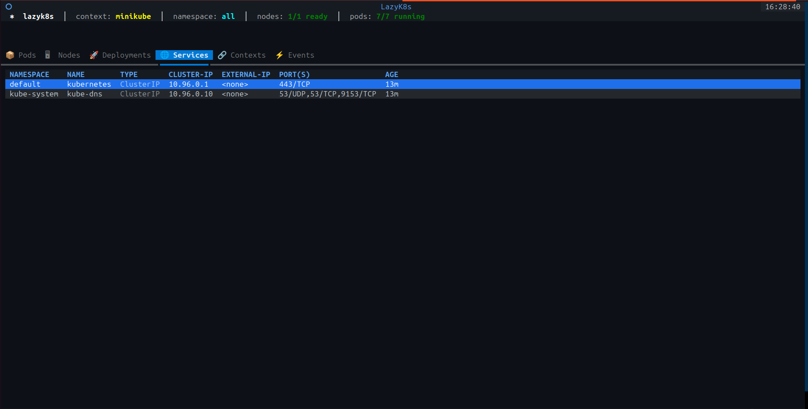
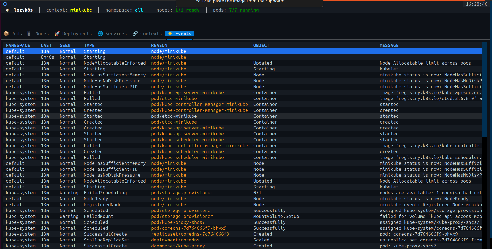

# ⎈ lazyk8s

A stylish, interactive Kubernetes TUI — see everything in your cluster without running individual `kubectl` commands.

## Install

### Linux / macOS
```bash
curl -fsSL https://raw.githubusercontent.com/Gowthamhegde/lazyk8s/main/install.sh | bash
```

### Windows (Command Prompt — run as Administrator)
```bat
curl -fsSL https://raw.githubusercontent.com/Gowthamhegde/lazyk8s/main/install.bat -o install.bat && install.bat
```

> Windows users: requires [Python](https://python.org/downloads) and [kubectl](https://kubernetes.io/docs/tasks/tools/). WSL also works — use the Linux install command inside WSL.

Then run:
```bash
lazyk8s
```

## Screenshots

**📦 Pods** — status, restarts, age, node at a glance


**🖥 Nodes** — node health, version, IP


**🚀 Deployments** — ready ratio, availability


**🌐 Services** — type, cluster IP, ports


**⚡ Events** — sorted by time, warnings highlighted


## Requirements

| Requirement | Linux/macOS | Windows |
|---|---|---|
| Python 3 | `sudo apt install python3` | [python.org](https://python.org/downloads) |
| kubectl | [Install guide](https://kubernetes.io/docs/tasks/tools/) | [Install guide](https://kubernetes.io/docs/tasks/tools/) |
| textual | auto-installed | auto-installed |

Works with **minikube**, **kind**, **EKS**, **GKE**, **AKS** — any kubectl context.

## Features

| Tab | What you see |
|---|---|
| 📦 Pods | Status, restarts, age, node — color-coded |
| 🖥 Nodes | Status, version, IP |
| 🚀 Deployments | Ready ratio, availability |
| 🌐 Services | Type color-coded (LoadBalancer / NodePort / ClusterIP) |
| 🔗 Contexts | All kubectl contexts, active one highlighted |
| ⚡ Events | Sorted by time, warnings in red |

## Keybindings

| Key | Action |
|---|---|
| `l` | View logs for selected pod |
| `d` | Describe selected resource |
| `c` | Switch kubectl context |
| `n` | Cycle namespaces |
| `e` | Jump to Events tab |
| `t` | Resource usage (`kubectl top`) |
| `/` | Live search / filter |
| `r` | Refresh |
| `q` | Quit |

## Uninstall

**Linux/macOS**
```bash
rm ~/.local/bin/lazyk8s
```

**Windows**
```bat
del %USERPROFILE%\.local\bin\lazyk8s.py
del %USERPROFILE%\.local\bin\lazyk8s.bat
```
